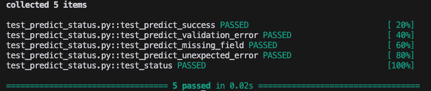
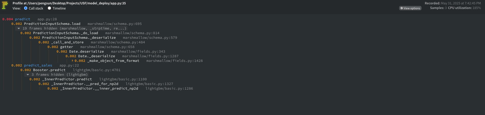
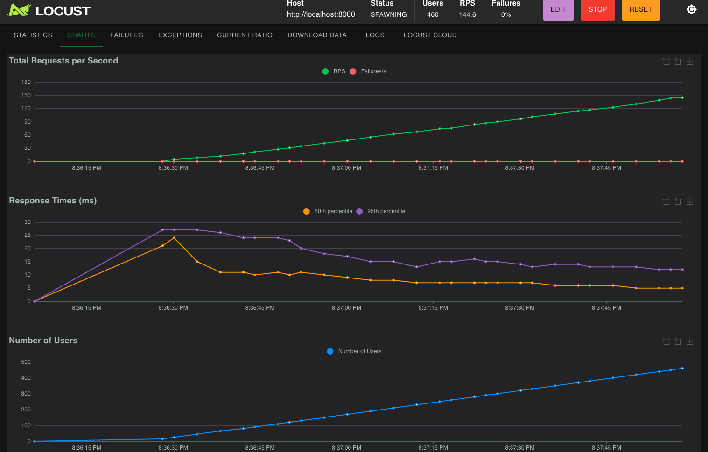

# Forecast Model API

## Overview

This project is designed to deploy a machine learning model, run unit tests, and monitor the application's performance and load. It also provides several alternative deployment solutions to suit different use cases and requirements, including FastAPI Async Implementation, AWS Lambda Function, and AWS SageMaker Endpoint.

## Model Training
- The training script is located in the `model_train` directory.
- Create  `input` directory under project folder. Download the dataset from [here](https://www.kaggle.com/c/demand-forecasting-kernels-only/data) and place dataset files in the `input` directory.
- The trained model is saved in the `model_deploy` directory as `model.joblib`.


## Deployment Instructions

1. **Build the Docker Image:**

   Navigate to the `model_deploy` directory and build the Docker image:

   ```bash
   cd model_deploy
   docker-compose build
   ```

2. **Run the Docker Container:**

   Deploy the app using the Docker image:

   ```bash
   docker-compose up -d model
   ```

   The application will be accessible at `http://localhost:8000`.

## Running Unit Tests

1. **Run Tests:**

   ```bash
   cd model_deploy
   python test_predict_status.py
   ```
2. **Test results:**
   
   


## Monitoring (Performance Testing and Load Testing) 

1. **Performance Testing of a Single API Call:**

    The API includes a profiler (enabled with `performance=true`) to analyze execution time and identify potential bottlenecks in the prediction process.

   ```bash
   curl -X POST -H "Content-Type: application/json" -d '{"date": "2013-01-01", "store": 1, "item": 1}' http://localhost:8000/predict?performance=true
   ```


   Profiler results in HTML format:
   
   

2. **Load Testing with Locust:**

   Load testing helps ensure the API can handle multiple concurrent users and maintain performance under expected  traffic conditions.

   Navigate to the `monitoring` directory and run Locust:

   ```bash
   cd monitoring
   locust -f locustfile.py --host=http://localhost:8000
   ```

   Open a browser and go to `http://localhost:8089` to start the load test.

   Load testing chart:

   


## Alternative Deployment Solutions

This project provides several alternative deployment options to suit different use cases and requirements:

### 1. FastAPI Async Implementation (`alternative_deployment/async_fastapi/`)

- Uses FastAPI's async capabilities for improved concurrency
- Suitable when:
  - API is IO bound and has external dependencies (databases, APIs, file systems)
  - Need to handle many concurrent requests efficiently
  - Need to generate automatic API documentation (via Swagger UI)
- Limitations:
  - Not suitable for CPU-bound tasks
  - Additional complexity in code structure
  - Learning curve for developers new to async patterns


### 2. AWS Lambda Function (`alternative_deployment/aws_lambda/`)

- Serverless deployment using AWS Lambda
- Suitable when:
  - Need a serverless architecture with minimal maintenance
  - Prediction requests are sporadic or have variable load
  - Need automatic scaling
  - Need a cost-effective solution
- Limitations:
  - Cold start latency
  - Maximum execution time limit (15 minutes)
  - Limited computing resources and storage
  - Payload size limitations (6MB)

### 3. AWS SageMaker Endpoint (`alternative_deployment/sagemaker_endpoint/`)

- Managed deployment using AWS SageMaker endpoints
- Suitable when:
  - Want a fully managed service for ML model deployment with minimal setup and configuration
  - Need reliable but simple deployment with good scalability
  - Need GPU support for inference
- Limitations:
  - Higher costs
  - Limited flexibility in customizing the runtime environment
  - Vendor lock-in to AWS ecosystem


Each deployment option has its own tradeoffs in terms of complexity, cost, scalability, and maintenance overhead. Choose based on the specific requirements.
